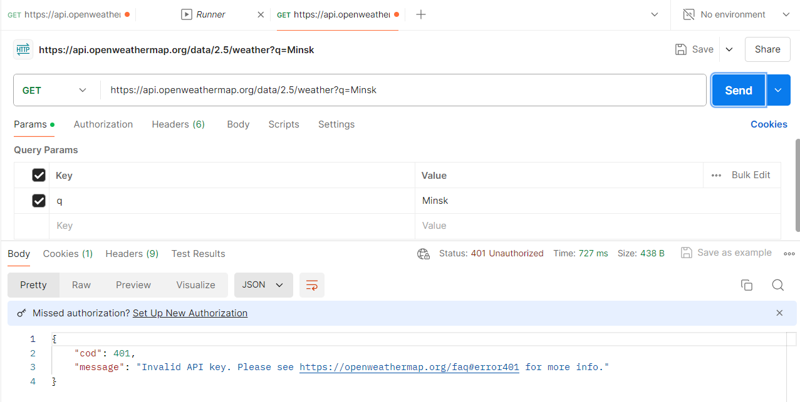
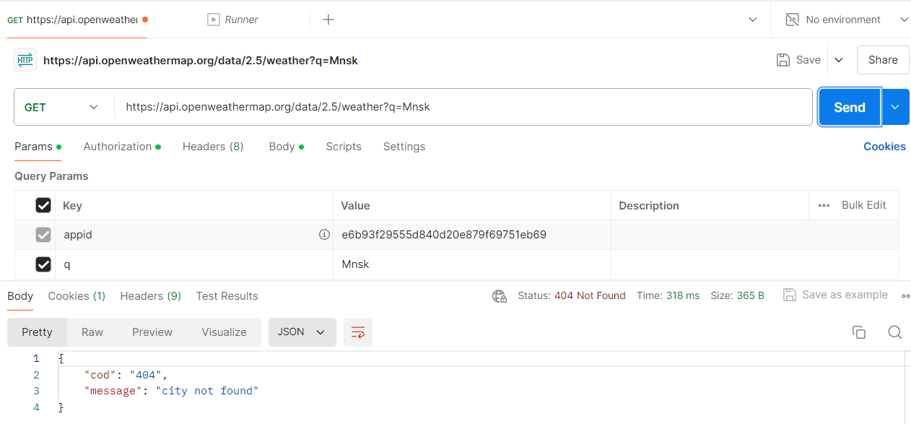
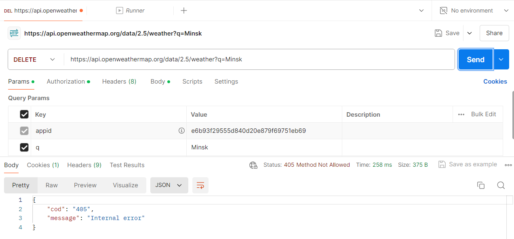

# Информационные ответы (100 - 199)
Информационные ответы используются для внутренних служебных сообщений между серверами и клиентами, и не возвращаются публичными API. Эти коды сигнализируют о промежуточных состояниях и не используются для окончательных ответов. 

# Успешные ответы (200 - 299)
Статусы 2xx указывают на успешное выполнение запроса клиента. Они возвращаются в ответ на запросы, которые успешно обработаны и вернули запрашиваемые данные. 
## 200 OK 

*Запрос был успешным, и сервер вернул запрашиваемые данные.*

OpenWeatherMap API не предоставляет возможность для создания новых ресурсов или совершения других операций, которые могут приводить к другим статусам.

# Сообщения о перенаправлении (300 - 399)
Статусы 3xx указывают на необходимость выполнения дополнительных действий для завершения запроса. Эти статусы нельзя получить с OpenWeatherMap API, так как API не включает функциональность перенаправления клиентских запросов на другие ресурсы.

# Ошибки клиента (400 - 499)
Статусы 4xx указывают на ошибки, связанные с запросом клиента. 
## 400 Bad Request 

*Неверный синтаксис запроса.*

## 401 Unauthorized 

*Ошибка аутентификации. Отсутствует API ключ.*
## 404 Not Found 

*Ресурс не найден.*
## 405 Method Not Allowed 

*Метод запроса известен серверу, но не поддерживается целевым ресурсом.*
# Ошибки сервера (500 - 599)
Получение кодов 5xx требует создания условий, при которых сервер не сможет корректно обработать запрос. В реальных условиях это сделать непросто, так как публичные API, такие как OpenWeatherMap, защищены от таких ошибок. 